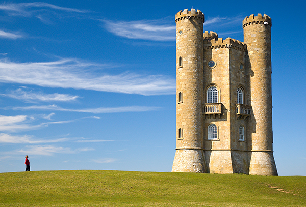
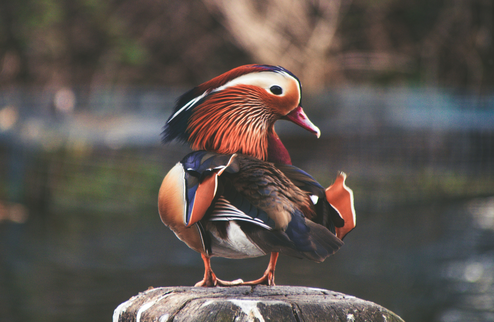
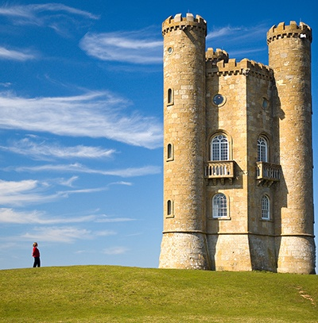
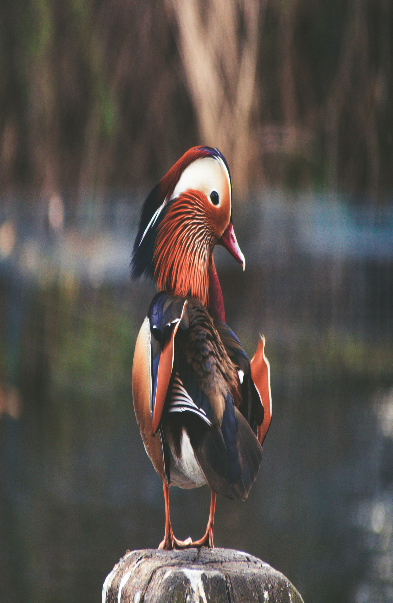

# SEAM-CARVING-CUDA

Seam Carving is a content-aware image resizing algorithm introduced in this [paper](https://perso.crans.org/frenoy/matlab2012/seamcarving.pdf). Unlike traditional resizing methods that distort images by scaling them uniformly, seam carving selectively adds or removes "seams"—paths of least importance—to preserve the image’s perceptual quality.

For a more detailed explanation, you can refer to the [original paper](https://perso.crans.org/frenoy/matlab2012/seamcarving.pdf). This repository was inspired by this [awesome project](https://github.com/li-plus/seam-carving), which provides a CPU-based implementation available as a Python package (pip). In contrast, our implementation uses CUDA to take advantage of the massive parallel processing power of GPUs for faster performance.

Currently, this repository supports only image downsizing. However, additional features such as image upsizing, auxiliary energy addition, and other enhancements mentioned in the paper will be introduced in future updates.

We also plan to optimize the CUDA kernels further to improve performance. That said, once the upsizing feature is implemented, our next priority will likely be adding extensive tests—debugging CUDA kernels without them can be quite tedious.

For now, if your use case involves image downsizing, this repository provides a fast and efficient solution.


## Quickstart

1. Clone the repository:

```bash
git clone https://github.com/soulsharp/Seam-Carving-CUDA
```

2. Install dependencies using pip:

```bash
pip install -r requirements.txt
```

3. Run the main file:

```bash
python main.py --img_path path_of_your_image --resized_width reduced_width --resized_height reduced_height
```

## Example usage:  
```bash
python main.py --img_path path_of_your_image --reduced_width 1000 --reduced_height 1000
```

Note that all parameters, ie img_path, reduced_width and reduced_height are mandatory. Results are saved to the examples/results folder.You will need to modify the code(the save_image function), to change the save_path of the resized image.

## Additional Arguments  

In the future, additional arguments pertaining to adding auxilliary image masks and image removal will be added.

## Sample results

The CPU-based [project](https://github.com/li-plus/seam-carving) mentioned earlier provides a benchmark for measuring the algorithm’s speed: resizing [castle.jpg](examples/images/castle.jpg) (407x600) by 200 pixels. Since our repository currently supports only downsizing, here’s a performance comparison for reducing the image’s width by 200 pixels (new size: 407×400).

CPU-based implementation (Google Colab, server-grade CPU): ~1.7 seconds on average
Our CUDA implementation (Google Colab, Tesla T4 GPU): ~0.38 seconds on average

For reducing both the image height and width by 200 pixels:

CPU-based implementation: ~2.9 seconds on average
Our CUDA implementation: ~0.64 seconds on average

For reducing image height by 500 pixels and image width by 500 pixels for this [Photo]() by <a href="https://unsplash.com/@paul_nic?utm_content=creditCopyText&utm_medium=referral&utm_source=unsplash">Paolo Nicolello</a> on <a href="https://unsplash.com/photos/selective-focus-photo-of-mandarin-duck-pifFRCiSK3E?utm_content=creditCopyText&utm_medium=referral&utm_source=unsplash">Unsplash</a> :

CPU-based implementation: ~370 seconds on average
Our CUDA implementation: ~45 seconds on average
      
This demonstrates a significant speedup using GPU acceleration(around 4.5x - 8x). Below, you’ll find a few results, including a standard cv2.resize for comparison to visualize distortions and content preservation.

### Original Images: 

  

Photo by <a href="https://unsplash.com/@paul_nic?utm_content=creditCopyText&utm_medium=referral&utm_source=unsplash">Paolo Nicolello</a> on <a href="https://unsplash.com/photos/selective-focus-photo-of-mandarin-duck-pifFRCiSK3E?utm_content=creditCopyText&utm_medium=referral&utm_source=unsplash">Unsplash</a>
      
      


Photo by <a href="https://unsplash.com/@joelfilip?utm_content=creditCopyText&utm_medium=referral&utm_source=unsplash">Joel Filipe</a> on <a href="https://unsplash.com/photos/multicolored-abstract-painting-QwoNAhbmLLo?utm_content=creditCopyText&utm_medium=referral&utm_source=unsplash">Unsplash</a>


      

### Resized via Seam Carving:

 

Width and Height reduced by 500 pixels


Width and Height reduced by 500 pixels



Width reduced by 200 pixels

### Resized via cv2.resize:



Width and Height reduced by 500 pixels


Width and Height reduced by 500 pixels


Width reduced by 200 pixels

## Contributing

Pull requests are welcome. For major changes, please open an issue first
to discuss what you would like to change.

## License

[MIT](https://choosealicense.com/licenses/mit/)